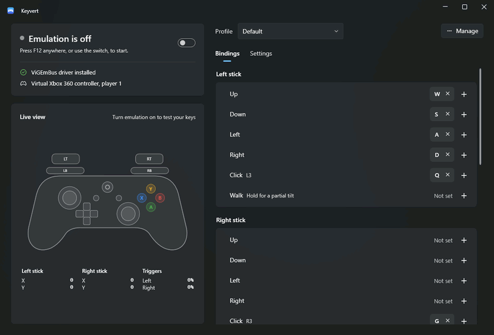

# Keyvert

Use your keyboard as a virtual Xbox 360 controller. Games that support Xbox controllers see a real
gamepad, while you play with the keys you choose.



- **Live view:** a drawing of the controller that lights up as you press keys, with the exact stick and trigger values.
- **Bindings editor:** click **+** next to a control and press a key. Bind several keys to one control, remove one with **×**.
- **Profiles:** one per game, with ready-made layouts for action, platformer, racing and twin-stick games.
  Create, duplicate, rename, delete, import and export them.
- **On/off hotkey:** **F12** by default. It works anywhere, even inside a game.
- **Tray icon:** keeps running in the notification area, where you can switch emulation and profiles.
- **Follows Windows:** light or dark theme, Windows 11 look.

## Installing

1. Install the **ViGEmBus** driver from its [official releases page](https://github.com/nefarius/ViGEmBus/releases/latest)
   (`ViGEmBus_…_x64_x86_arm64.exe`). It's what lets Windows show a virtual controller. Reboot if the
   installer asks. The app never installs drivers by itself; if the driver is missing, it says so and links to this page.
   ViGEmBus is no longer developed by its author, but the last release still installs and works on Windows 10 and 11.
2. Download `Keyvert.exe` from the [latest release](https://github.com/JarmezeiFerenc/keyvert/releases/latest)
   and run it. It needs no installation and no .NET runtime.

Windows SmartScreen may warn that the app is unrecognized, because the exe isn't code-signed.
Choose **More info → Run anyway**.

## Using it

1. Pick a profile: **Default**, or one of the game layouts below.
2. Turn emulation on with the switch or **F12**. You hear a high beep when it turns on, a low one when it turns off.
3. Start your game. It sees an Xbox 360 controller. Press F12 again to get your keyboard back.

While emulation is on, mapped keys are taken over everywhere in Windows, not only in the game.
Turn it off before typing in chat or other apps.

Closing the window keeps the app running in the tray. Right-click the tray icon and choose **Exit** to
quit. Settings can change both behaviors.

### Default layout

Made to work in most games without a mouse. The left hand moves and uses the usual PC keys, the right
hand turns the camera with the triggers above it, and the arrow keys drive the D-pad, so menus work too.

| Keys | Controller |
| --- | --- |
| W A S D | Left stick |
| I J K L | Right stick (camera) |
| Left Shift / H | Left / right stick click |
| Space or Enter | A |
| Left Ctrl or Backspace | B |
| E / R | X / Y |
| Q / F | LB / RB |
| U / O | LT / RT |
| Arrow keys | D-pad |
| Esc / Tab | Start / Back |

Walk and the Guide button start unbound.

### Game layouts

On first start, Keyvert creates a profile for each built-in layout. You can add one again any time with
**Manage → Add a game layout**, and **Manage → Reset layout** restores a profile to the layout it came from.

| Layout | For | Main keys |
| --- | --- | --- |
| Default | Most games | See above |
| Action (Souls-like) | Third-person action games | WASD move, IJKL camera, Space dodge, E interact, Q lock-on, U O Y P bumpers and triggers, hold Ctrl to walk |
| Platformer | 2D platformers | Arrow keys move, Z jump, X attack, C dash, A S D F bumpers and triggers |
| Racing | Driving games | W throttle, S brake, A D steer, Space handbrake, hold Shift to steer gently, arrow keys for menus |
| Twin-stick shooter | Top-down shooters | WASD move, arrow keys aim, Space fire, Shift left trigger, 1–4 D-pad |
| Minecraft Dungeons | Minecraft Dungeons | WASD move, Space / 2 / O / 1 for A / B / X / Y |

### Settings

| Setting | What it does |
| --- | --- |
| On/off hotkey | The key that toggles emulation. It never reaches the game. |
| Block mapped keys | On by default. Games get only the controller input from mapped keys, not the keys too. |
| Turn on at startup | Start emulating as soon as the app opens. |
| Sound on toggle | Beep when emulation turns on or off. |
| Walk speed | Per profile. How far the left stick tilts while the Walk key is held. |
| Keep running when closed | Closing the window hides it to the tray instead of exiting. |
| Start in the tray | Open without showing the window. |

## Files

Everything is stored in `%APPDATA%\Keyvert`:

- `Profiles\*.json` contains one file per profile. Share a profile with **Manage → Export**, and load one with **Import**.
- `settings.json` holds the app settings.
- `Logs\app.log` records startup, profile changes and errors. Attach it when reporting a problem.

A profile file maps key names to actions:

```json
{
  "walkScale": 0.5,
  "bindings": {
    "W": "LeftStickUp",
    "Space": "A",
    "E": "LT"
  }
}
```

**Actions:** `A B X Y LB RB LT RT LS RS Back Start Guide`, `DpadUp/Down/Left/Right`,
`LeftStickUp/Down/Left/Right`, `RightStickUp/Down/Left/Right`, `Walk`.

**Key names** are Windows Forms [`Keys`](https://learn.microsoft.com/dotnet/api/system.windows.forms.keys) names
(`W`, `Space`, `D1`, `F5`, `NumPad8`, `LShiftKey`, `Oemcomma`, …). The aliases `0`–`9`, `LeftShift`,
`LeftCtrl`, `LeftAlt`, `Enter`, `Esc` and similar also work.

## Troubleshooting

| Problem | Fix |
| --- | --- |
| "ViGEmBus driver not installed" | Install the driver (see Installing), then select **Try again**. |
| The game doesn't react | Make sure emulation is on (green dot). Check that the game has controller support turned on. Open `joy.cpl` to see whether Windows lists the controller. |
| Keys stop working while a game runs as administrator | Windows hides key presses in elevated windows from normal apps. Run Keyvert as administrator too. |
| The game gets both keyboard and controller input | Turn on **Block mapped keys**. |
| I can't type in other apps | Emulation is on and blocking mapped keys. Press the hotkey to turn it off. |
| Online game kicks or warns me | Some anti-cheat systems reject virtual controllers or input remappers. Check the game's rules. |
| Something else | Check `%APPDATA%\Keyvert\Logs\app.log`. |

Key presses generated by other software (macro tools, remote desktop helpers) are ignored on purpose,
so the app can't get into a loop with other input tools.

## Building from source

Requires the .NET 10 SDK on Windows.

```bash
dotnet build -c Release
```

Single-file exe that runs without .NET installed:

```bash
dotnet publish src/Keyvert -c Release -r win-x64 --self-contained -p:PublishSingleFile=true -p:IncludeNativeLibrariesForSelfExtract=true -p:EnableCompressionInSingleFile=true -p:DebugType=none -o publish
```

### Project layout

```
src/Keyvert/
  Core/        Mapping logic, profiles and key names (no Windows UI code)
  Services/    Keyboard hook, ViGEm controller, engine, profile/settings storage, tray, logging
  ViewModels/  MVVM view models (CommunityToolkit.Mvvm)
  Views/       WPF windows and the live controller drawing (WPF-UI)
  Assets/      App and tray icons
```

The keyboard hook runs on its own high-priority thread, so a busy window never delays input.
Controller reports are sent from a separate thread, so the hook never waits on the driver.
When the app exits, crashes or the PC is locked, the controller returns to neutral.

## License

Keyvert is released under the [MIT License](LICENSE).

It's built on these open-source projects:

- [ViGEmBus](https://github.com/nefarius/ViGEmBus) and [ViGEm.NET](https://github.com/nefarius/ViGEm.NET) by Benjamin Höglinger-Stelzer, for the virtual controller
- [WPF UI](https://github.com/lepoco/wpfui) by lepo.co, for the Windows 11 look
- [.NET Community Toolkit](https://github.com/CommunityToolkit/dotnet), for the MVVM helpers
